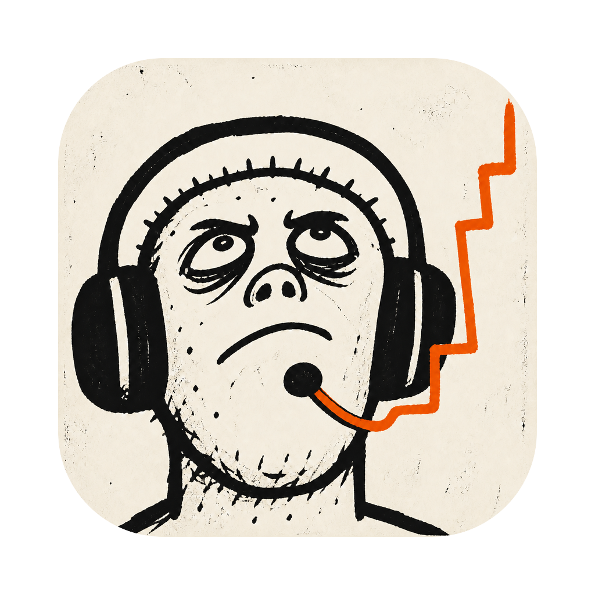
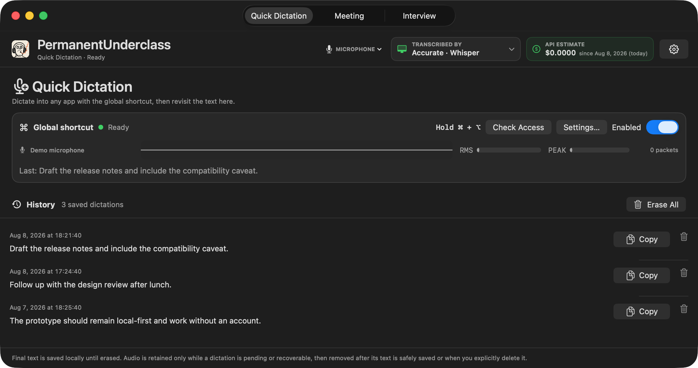
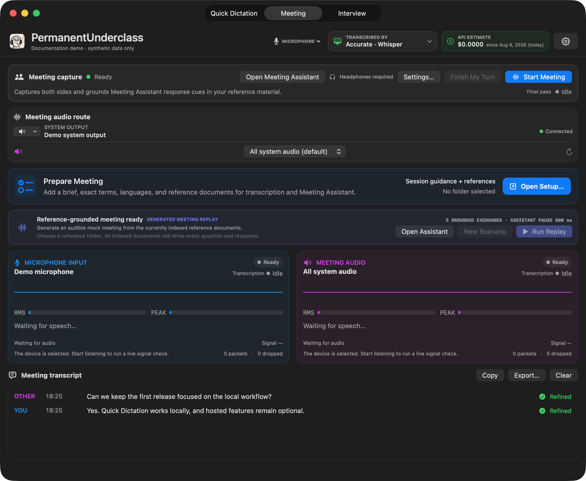
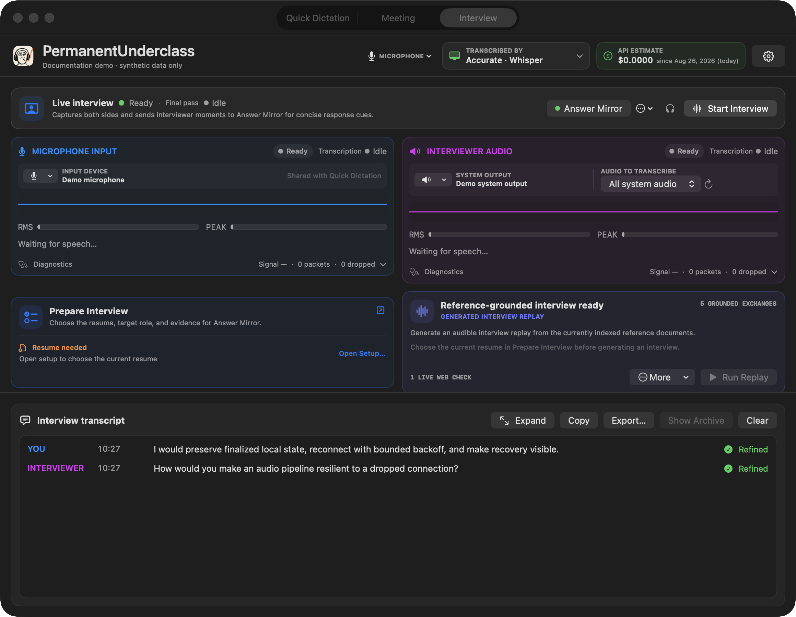

<p align="center">
  
</p>

<h1 align="center">PermanentUnderclass</h1>

PermanentUnderclass is an experimental native macOS app for local-first quick
dictation, two-track meeting and interview transcription, and optional live
response cues grounded in your own reference material.

It changes quickly, but tagged releases provide a signed and notarized build for
Apple silicon Macs.

Every screenshot below is generated with the app's synthetic documentation
mode. It does not load Keychain credentials, saved dictations, reference
folders, audio devices, or running-process names.



## What it does

- **Quick Dictation:** hold Command–Option, speak, and paste the final text into
  the app that was focused when you started. Local Whisper is the default, so
  this works without an account or API key.
- **Meeting:** capture the microphone and system audio as separate speakers,
  keep a live transcript, and optionally show grounded response cues in a
  browser display on this Mac or another computer on the same trusted LAN.
- **Interview:** use the same two-track capture with an Answer Mirror that
  suggests concise answer beats without inventing personal experience.

## Download

The [latest GitHub release](https://github.com/dpasca/PermanentUnderclass/releases/latest)
contains `PermanentUnderclass-macOS-arm64.zip`. Expand it, move
`PermanentUnderclass.app` to Applications, and launch it normally. The archive
is Developer ID signed, notarized, stapled, and accompanied by a SHA-256
checksum. Intel Macs and non-macOS systems are not supported.

## More screenshots

| Meeting | Interview |
| --- | --- |
|  |  |

## Privacy at a glance

🟢 `LOCAL` stays on the Mac · 🟡 `OPTIONAL CLOUD` is explicitly selected ·
🔵 `HOSTED` is required while that feature is active

| Feature | On this Mac | Network use |
| --- | --- | --- |
| 🎙️ **Quick Dictation** | 🟢 `LOCAL DEFAULT`<br>Local-model audio processing, saved final-text history, and temporary recoverable audio | 🟡 `OPTIONAL CLOUD`<br>Audio only when OpenAI GPT-Transcribe is selected |
| 👥 **Meeting and interview** | 🟢 `LOCAL SESSION STATE`<br>UI state and the in-memory transcript | 🔵 `HOSTED TRANSCRIPTION`<br>Live microphone and system audio while capture is running |
| ✨ **Final transcript pass** | 🟢 `ON-DEVICE OPTION`<br>Whisper or Parakeet | 🟡 `OPTIONAL CLOUD`<br>Audio only when the OpenAI finalizer is selected |
| 📚 **Meeting Assistant and Answer Mirror** | 🟢 `LOCAL RETRIEVAL`<br>Reference indexing and the embedded browser gateway | 🟡 `ON-DEMAND CLOUD`<br>Relevant reference text and transcript context used to generate cues; presentation-ready session state can also be viewed over a trusted LAN |

> 🔒 `PRIVACY LOCK` **Never contact OpenAI** disables every hosted path.

The API key is stored in macOS Keychain. The companion display never receives
the API key or full reference corpus. Its manual LAN-address mode is currently
plain HTTP without pairing, so use it only on a trusted local network. Meeting
and interview audio is not continuously recorded to disk;
Quick Dictation retains audio only while a transcription is pending or
recoverable.

## Requirements

- macOS 14.2 or newer.
- Apple Silicon for the local Whisper and Parakeet engines.
- Headphones for meeting or interview capture, to avoid feedback and speaker
  leakage.
- An OpenAI API key for meeting/interview live transcription and assistant
  features. It is not required for local Quick Dictation.

## Build and run

Building from source requires the Xcode command-line tools and Swift 5.10 or
newer. Clone the repository, then run:

```sh
swift test
./scripts/run-app.sh
```

The first run asks for the relevant macOS microphone, accessibility, and system
audio permissions as features need them. For an explicit release build:

```sh
./scripts/build-app.sh release
```

The app bundle is written to `.build/PermanentUnderclass.app`. The script uses an
installed Developer ID Application certificate when available and otherwise
falls back to ad hoc signing. Tagged releases use a separate workflow that
requires Developer ID signing and Apple notarization before publishing.

### Answer Mirror quality eval

The normal test suite uses deterministic fixtures and does not call hosted
models. To run the opt-in Answer Mirror eval against recorded interview moments,
including general-knowledge, local-reference, web-search, and unfinished-turn
cases:

```sh
OPENAI_API_KEY="..." RUN_ASSISTANT_QUALITY_EVALS=1 \
  swift test --filter LiveAssistantQualityEvalTests
```

The eval generates real cues and uses a structured model judge for directness,
spoken naturalness, specificity, grounding safety, and concise usability. Set
`ANSWER_MIRROR_EVAL_JUDGE_MODEL` to use a different available judge model. The
eval makes hosted API requests and may incur usage charges. To iterate on one
fixture, also set `ANSWER_MIRROR_EVAL_CASE` to its printed case name.

## Documentation

- [Detailed product and operating guide](Docs/product-guide.md)
- [Live assistant architecture](Docs/live-assistant-architecture.md)
- [Open-source publication checklist](Docs/open-source-checklist.md)
- [Release engineering](Docs/release-engineering.md)
- [Third-party dependency notices](AppBundle/THIRD_PARTY_NOTICES.md)

## Project policy

This is a utility that I constantly change to suit specific needs, so it is not
accepting external code contributions or pull requests. Bug reports are welcome,
and anyone is free to fork and modify it for their own use. See
[CONTRIBUTING.md](CONTRIBUTING.md) and [SECURITY.md](SECURITY.md) before opening
a report.

## License

PermanentUnderclass is available under the [MIT License](LICENSE). That license
covers the project-owned source code and artwork in this repository, including
the application icon. Third-party code and downloaded models remain under
their respective licenses, recorded in
[AppBundle/THIRD_PARTY_NOTICES.md](AppBundle/THIRD_PARTY_NOTICES.md).
