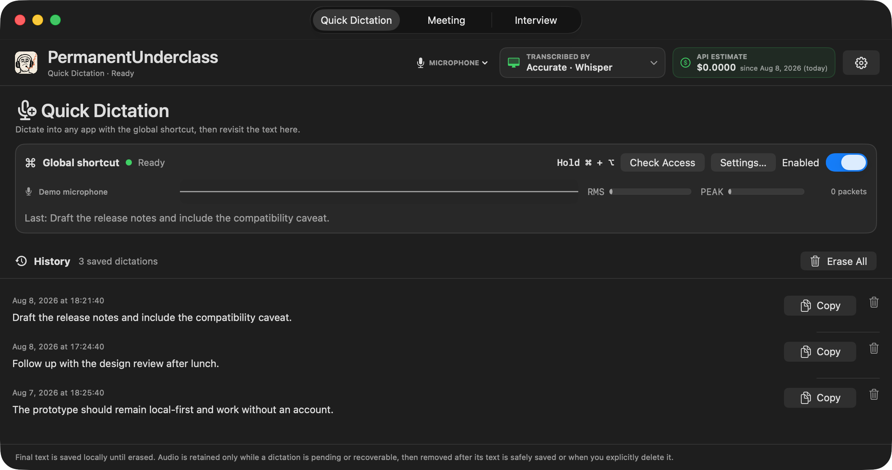
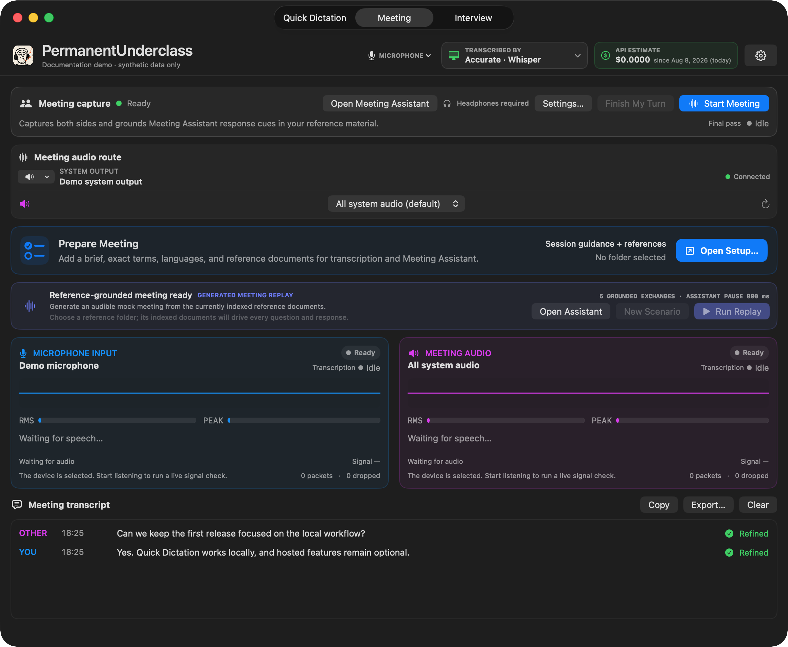
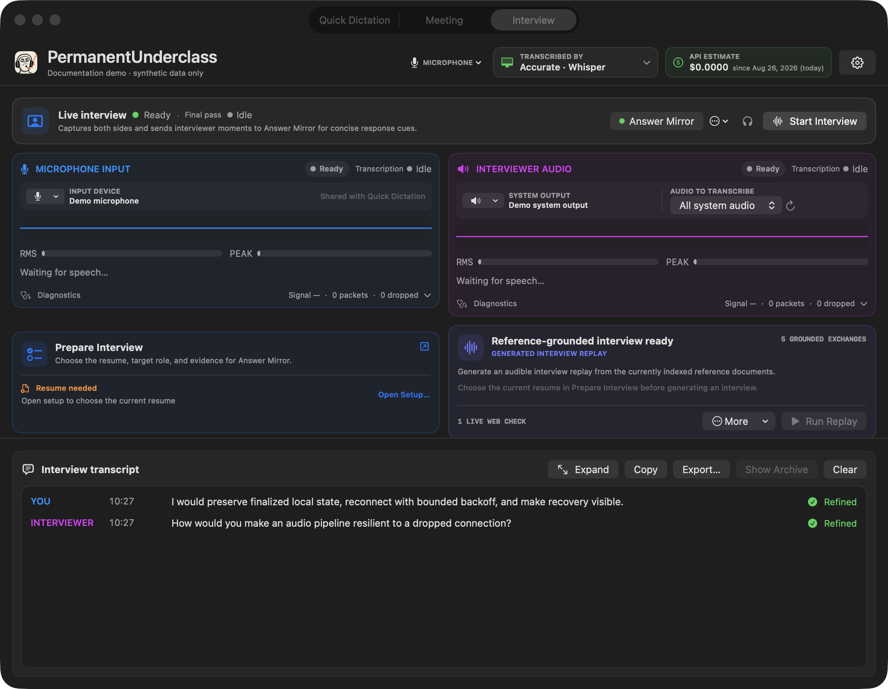

<p align="center">
  
</p>

<h1 align="center">PermanentUnderclass</h1>

PermanentUnderclass is an experimental native macOS app for local-first quick
dictation, two-track meeting and interview transcription, and optional live
response cues grounded in your own reference material.

It changes quickly, but tagged releases provide a signed and notarized build for
Apple silicon Macs.

Every screenshot below is generated with the app's synthetic documentation
mode. It does not load Keychain credentials, saved dictations, reference
folders, audio devices, or running-process names.



## What it does

- **Quick Dictation:** hold Command–Option, speak, and paste the final text into
  the app that was focused when you started. Local Whisper is the default, so
  this works without an account or API key.
- **Meeting:** capture the microphone and system audio as separate speakers,
  transcribe completed turns locally with Whisper or Parakeet, and optionally
  add grounded response cues with either OpenAI or Gemini. An OpenAI key also
  adds word-by-word live text.
- **Interview:** use the same two-track capture with an Answer Mirror that
  suggests concise answer beats without inventing personal experience. An
  explicit Plausible Rehearsal mode can draft project-specific examples to
  verify, with an optional fact-free thinking bridge while the question is
  still being spoken. Each interview is also archived locally as JSON with its
  final transcript and every displayed assistant cue.

## Download

The [latest GitHub release](https://github.com/dpasca/PermanentUnderclass/releases/latest)
contains `PermanentUnderclass-macOS-arm64.zip`. Expand it, move
`PermanentUnderclass.app` to Applications, and launch it normally. The archive
is Developer ID signed, notarized, stapled, and accompanied by a SHA-256
checksum. Intel Macs and non-macOS systems are not supported.

## Japanese language assistance

In **Settings → General → Japanese language assistance**, choose translation
only or translation with suggested replies before starting a Meeting or
Interview. Open the live assistant display to see the other speaker's English
translation and, when useful, a polite Japanese reply with kanji + furigana,
kana, romaji, and English meaning. Original transcripts stay in the language
spoken. Both microphone and system audio accept Japanese and English.

Translation uses the selected OpenAI or Gemini suggestion provider and its API
key. With an OpenAI transcription key, original speech appears word by word
and translations update while the other speaker talks. Requests sample the
latest text about once a second when the previous request has finished;
translation still has model/network latency. Without live transcription,
text and translation follow completed locally transcribed turns. Japanese mode uses
Whisper automatically if the selected Fast/Parakeet engine cannot handle it,
and uses grounded replies even in an interview configured for rehearsal.
Privacy Lock disables translation and replies along with other cloud features.

Meeting and Interview use the same live language view. It shows both speakers'
original words, English translations paired with short Japanese passages, and
Japanese replies after completed turns. Completed passages keep their English
wording; only the last unfinished draft updates. If transcription corrects an
earlier passage, its replacement is marked **Transcript corrected**. English
appears first, with its source beside it (underneath on narrow screens).
Conversation history stays scrollable
throughout the session and survives browser reconnects. New updates do not
pull you away from older passages; **Pause scrolling** holds your reading
position, and **Follow live** returns to the latest speech. Live drafts occupy a
fixed-size area below the completed reading history; following advances when
passages complete, not with every incoming word. The Mac transcript and its
Copy/Export actions retain paired passages too. Stopping preserves the completed
live breakdown; late translations may finish its tail, while conflicting final
transcript corrections remain separately available under a disclosure (or at
the end of the exported turn). "Other" is the shared remote-audio track, not
identification of individual participants.
History resets when starting or clearing a session; interview archives remain
available separately.

For Japanese Quick Dictation, include `ja` in **Languages you speak** (for
example `en, ja`); its engine also falls back to Whisper when needed. Language
assistance does not synthesize or play spoken replies.

The slash command palette also provides these shortcuts:

| Command | Action |
| --- | --- |
| `/assistant.language.translate` | Translate Japanese into English |
| `/assistant.language.replies` | Translate and suggest Japanese replies with pronunciation |
| `/assistant.language.off` | Turn language assistance off |
| `/transcription.languages.japanese` | Set speech hints to Japanese |
| `/transcription.languages.english-japanese` | Set speech hints to English and Japanese |
| `/transcription.languages.english` | Set speech hints to English |
| `/transcription.languages.auto` | Clear speech hints for automatic language detection |
| `/settings.languages` | Open language settings, including custom language codes |

Change assistance before starting capture or a replay. Speech-language presets
are unavailable during capture or Quick Dictation. Japanese assistance adds
English and Japanese call hints independently of the dictation preset.

## More screenshots

| Meeting | Interview |
| --- | --- |
|  |  |

## Privacy at a glance

🟢 `LOCAL` stays on the Mac · 🟡 `OPTIONAL CLOUD` is explicitly selected ·
🔵 `HOSTED` is required while that feature is active

| Feature | On this Mac | Network use |
| --- | --- | --- |
| 🎙️ **Quick Dictation** | 🟢 `LOCAL DEFAULT`<br>Local-model audio processing, saved final-text history, and temporary recoverable audio | 🟡 `OPTIONAL CLOUD`<br>Audio only when OpenAI GPT-Transcribe is selected |
| 👥 **Meeting and interview** | 🟢 `LOCAL CAPTURE`<br>Separate microphone/system tracks, on-device turn detection, Whisper or Parakeet transcription after each completed turn, and local JSON archives for interviews | 🟡 `OPTIONAL CLOUD`<br>Word-by-word partial text when an OpenAI key is configured |
| ✨ **Final transcript pass** | 🟢 `ON-DEVICE OPTION`<br>Whisper or Parakeet | 🟡 `OPTIONAL CLOUD`<br>Audio only when the OpenAI finalizer is selected |
| 📚 **Meeting Assistant and Answer Mirror** | 🟢 `LOCAL RETRIEVAL`<br>Reference indexing and the embedded browser gateway | 🟡 `ON-DEMAND CLOUD`<br>OpenAI `gpt-5.6-luna` or Google `gemini-3.7-flash` generates cues from relevant reference text and transcript context; presentation-ready session state can also be viewed over a trusted LAN |

> 🔒 `PRIVACY LOCK` **Never contact cloud services** disables every hosted path while
> keeping local Quick Dictation and local meeting/interview transcripts available.

API keys are stored in macOS Keychain. The companion display never receives
an API key or the full reference corpus. Its manual LAN-address mode is currently
plain HTTP without pairing, so use it only on a trusted local network. Meeting
and interview audio is not continuously recorded to disk;
Quick Dictation retains audio only while a transcription is pending or
recoverable. Interview archives contain text and assistant output, not audio,
under `~/Library/Application Support/com.newtypekk.punderclass/InterviewSessions/`.

## Requirements

- macOS 14.2 or newer.
- Apple Silicon for the local Whisper and Parakeet engines.
- Headphones for meeting or interview capture, to avoid feedback and speaker
  leakage.
- An OpenAI API key for word-by-word meeting/interview text, OpenAI-backed
  assistant cues, generated replay scenarios, source preparation, or
  GPT-Transcribe. A generated replay also needs the selected cue provider's key.
- A Gemini API key only when `gemini-3.7-flash` is selected for Meeting
  Assistant and Answer Mirror. Gemini uses medium thinking and can ground cues
  with Google Search; grounded cues display Google's associated Search
  Suggestions while the session is live. Local Quick Dictation and
  completed-turn meeting/interview transcripts require neither key.

## Build and run

Building from source requires the Xcode command-line tools and Swift 5.10 or
newer. Clone the repository, then run:

```sh
swift test
node --test Tests/LiveAssistantTests/language-passages.test.cjs
./scripts/run-app.sh
```

The first run asks for the relevant macOS microphone, accessibility, and system
audio permissions as features need them. For an explicit release build:

```sh
./scripts/build-app.sh release
```

The app bundle is written to `.build/PermanentUnderclass.app`. The script uses an
installed Developer ID Application certificate when available and otherwise
falls back to ad hoc signing. Tagged releases use a separate workflow that
requires Developer ID signing and Apple notarization before publishing.

### Gemini live-assistant smoke test

The normal suite uses local fixtures. To exercise the complete Gemini adapter,
including medium thinking, structured output, required Google Search, citations,
and Search Suggestions:

```sh
GEMINI_API_KEY="..." RUN_GEMINI_LIVE_ASSISTANT_SMOKE=1 \
  swift test --filter GeminiLiveAssistantAPITests/testHostedGemini37FlashMediumThinkingAndSearchSmoke
```

This opt-in test makes a hosted request and may incur Gemini API charges.

### Answer Mirror quality eval

The normal test suite uses deterministic fixtures and does not call hosted
models. To run the opt-in Answer Mirror eval against recorded interview moments,
including general-knowledge, local-reference, web-search, and unfinished-turn
cases:

```sh
OPENAI_API_KEY="..." RUN_ASSISTANT_QUALITY_EVALS=1 \
  swift test --filter LiveAssistantQualityEvalTests
```

The eval generates real cues and uses a structured model judge for directness,
spoken naturalness, plain spoken language, specificity, causal usefulness,
grounding safety, mechanistic depth, verification rigor, plausibility safety,
answer-mode usefulness, and concise usability. Set
`ANSWER_MIRROR_EVAL_JUDGE_MODEL` to use a different available judge model. The
eval makes hosted API requests and may incur usage charges. To iterate on one
fixture, also set `ANSWER_MIRROR_EVAL_CASE` to its printed case name.

The resume-derived interview-description draft has a smaller hosted timing and
grounding check that uses synthetic career data only:

```sh
OPENAI_API_KEY="..." RUN_INTERVIEW_CONTEXT_SUGGESTION_EVAL=1 \
  swift test --filter InterviewContextSuggestionClientTests/testHostedSuggestionFavorsRecentWorkWithoutInventingLanguage
```

The early bridge has a smaller non-personal hosted eval that checks an
unfinished partial, two clear requests, and the measured Priority Luna latency:

```sh
OPENAI_API_KEY="..." RUN_EARLY_BRIDGE_EVAL=1 \
  swift test --filter \
  LiveAssistantQualityEvalTests/testHostedEarlyInterviewBridgeLatencyAndSafety
```

It incurs hosted Priority-processing usage. The deterministic suite still
verifies its strict schema, speculative-attempt limit, independent pause/final
opportunities, and replacement state without making network calls.

The non-personal cross-provider matrix sends the same five interview cases,
reference snapshot, structured schema, and output limit to every candidate with
hosted search disabled. The OpenAI key also powers the separate quality judge:

```sh
OPENAI_API_KEY="..." GEMINI_API_KEY="..." \
  RUN_LIVE_ASSISTANT_MODEL_MATRIX=1 \
  swift test --filter \
  LiveAssistantModelMatrixTests/testHostedCrossProviderSweetSpotMatrix
```

Use `LIVE_ASSISTANT_MATRIX_CONFIGS` for a comma-separated subset and
`LIVE_ASSISTANT_MATRIX_REPETITIONS` to repeat every cell. This opt-in test makes
hosted requests to both providers and may incur API charges.

For model, reasoning-effort, and prompt selection against private interview
material, keep the fixture outside the repository and run:

```sh
OPENAI_API_KEY="..." RUN_ANSWER_MIRROR_PRIVATE_BENCHMARK=1 \
  ANSWER_MIRROR_PRIVATE_BENCHMARK_PATH="/absolute/private-suite.json" \
  swift test --filter LiveAssistantPrivateBenchmarkTests
```

The external JSON contains `cases` with `name`, `question`,
`referenceFolderPath`, `answerMode`, and `expectedGrounding`; optional fields are
`recentTranscript`, `currentPartial`, and `sessionContext`. It may also contain
`promptVariants`, each with `name` and optional `instructions`. By default the
benchmark compares Luna at none, low, and xhigh reasoning with Terra at none,
low, and medium reasoning. Override the matrix with a comma-separated value such
as `ANSWER_MIRROR_BENCHMARK_CONFIGS="gpt-5.6-terra:low,gpt-5.6-luna:xhigh"`
and repeat each cell with `ANSWER_MIRROR_BENCHMARK_REPETITIONS=3`. It prints
JSON result and aggregate lines with generation latency and structured quality
scores. Files ending in `.answer-mirror-benchmark.json` and the local
`.answer-mirror-benchmarks/` directory are ignored by Git.

## Documentation

- [Detailed product and operating guide](Docs/product-guide.md)
- [Live assistant architecture](Docs/live-assistant-architecture.md)
- [Open-source publication checklist](Docs/open-source-checklist.md)
- [Release engineering](Docs/release-engineering.md)
- [Third-party dependency notices](AppBundle/THIRD_PARTY_NOTICES.md)

## Project policy

This is a utility that I constantly change to suit specific needs, so it is not
accepting external code contributions or pull requests. Bug reports are welcome,
and anyone is free to fork and modify it for their own use. See
[CONTRIBUTING.md](CONTRIBUTING.md) and [SECURITY.md](SECURITY.md) before opening
a report.

## License

PermanentUnderclass is available under the [MIT License](LICENSE). That license
covers the project-owned source code and artwork in this repository, including
the application icon. Third-party code and downloaded models remain under
their respective licenses, recorded in
[AppBundle/THIRD_PARTY_NOTICES.md](AppBundle/THIRD_PARTY_NOTICES.md).
